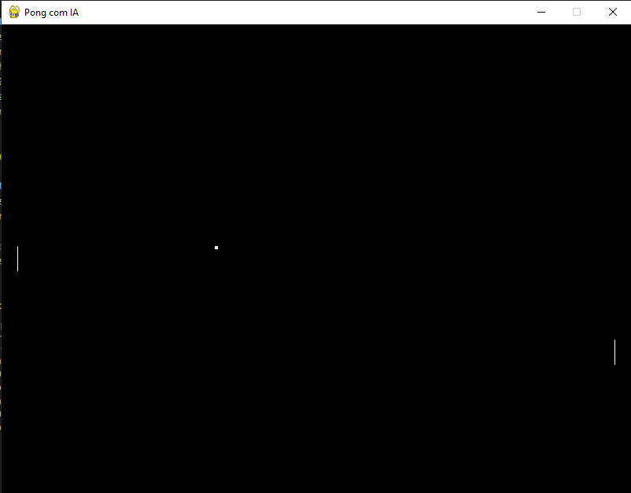

# Pong IA
Este é um projeto simples para demonstrar como utilizar aprendizado de máquina para criar uma inteligência artificial capaz de jogar Pong.

## Funcionalidades
O jogo Pong consiste em duas barras (paddles) em lados opostos da tela e uma bola que é rebatida pelas barras. O objetivo é fazer com que a bola passe pela barra do oponente.

Neste projeto, a IA é responsável por controlar a barra do lado direito e tentar vencer o jogo contra um jogador humano que controla a barra do lado esquerdo.

As principais funcionalidades do projeto são:
- Treinamento do modelo de IA a partir de um conjunto de dados de treinamento
- Utilização do modelo treinado para fazer previsões do movimento do paddle da IA

## Como jogar
Use as teclas W e S para mover o paddle da esquerda e a IA controla o paddle da direita.

Obs.: Verifique o parâmetro 'MOVIMENTACAO_PADDLE_ESQUERDA' no arquivo [config.ini](config.ini).

## Arquivos Inclusos
- variaveis.py: contém as variáveis utilizadas no jogo.
- ia.py: contém a lógica da IA.
- config.ini: Configura o modo de jogo/treino.
- sprites: pasta com as sptrites utilizadas no jogo.

## Execução
1 - Clone este repositório para o seu computador:
```
    git clone https://github.com/cleytongomes/pong-with-ia.git
```
2 - Instale as dependências necessárias
```
    pip install -r requirements.txt
```
3 - Execute o arquivo pong.py:
```
python pong.py
```
4 - Divirta-se!

## Observações
- A IA grava as posições da bola em cada colisão e usa essas informações para prever a próxima posição da bola e mover o paddle da direita de acordo.

## Demonstração


## Contribuição
Sinta-se à vontade para contribuir com o projeto! Você pode abrir uma issue para relatar um bug, sugerir uma melhoria ou implementar uma nova funcionalidade. Além disso, pull requests são sempre bem-vindos!
